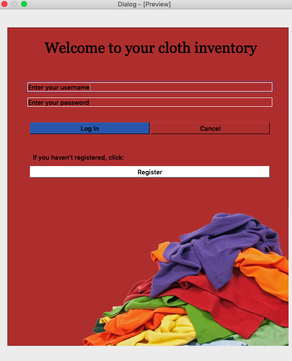
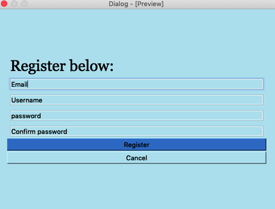
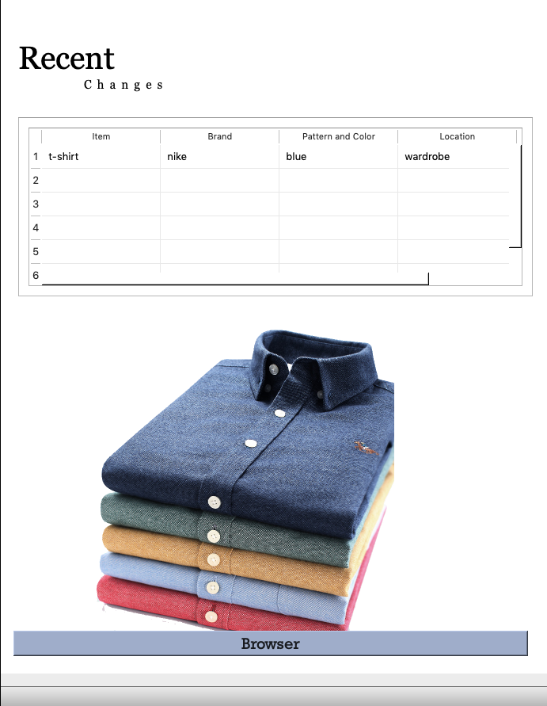
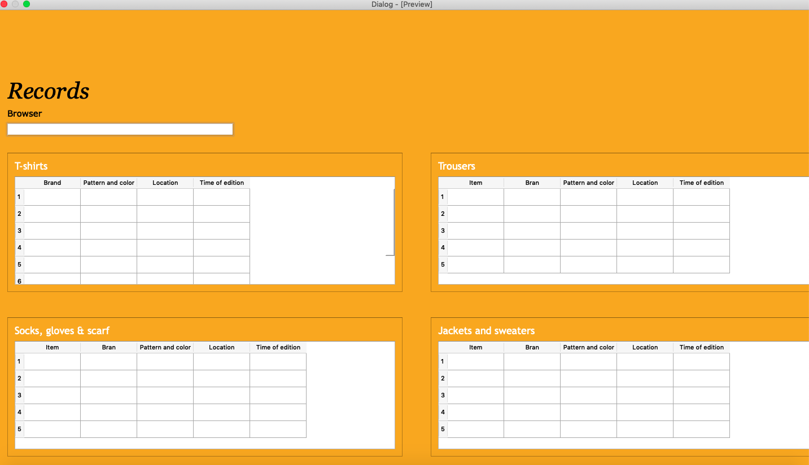

System Diagram
==================
This Fig.1 is a graphical representation of the system. From the image we can see that the input will be made by a keyboard and mouse and the output will be shown through a screen monitor. The app will consist of 4 user interfaces which will be described below. The arrows show the interaction between the user interface (one user interface allows the access to another).

User Interfaces
===================
Below, there are the user interfaces for the inventory app
Login Window
-------------

Register Window
----------------
The registration interface has an input bar for a special key that only the client and me, the developer, know. This is criteria nr 1, which also can be found described by the client in appendix nr. 

Main Window
--------------------
This user interface shows all the item which are not located in the default location.

Main Records Window 
---------------------
This user interface shows all the recorded items divided into categories and subcategories.

Flowcharts
-------------
The followng flowcharts show the log in process for the inventory app.

Test Plan
-------------
The application was tested using the dynamic method, which is described in the tables. Each component was tested individually as the program was developed and at the end everything was tested as a whole.

