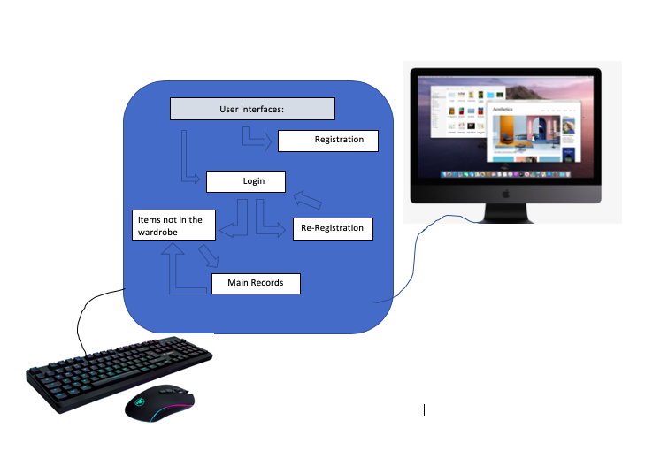
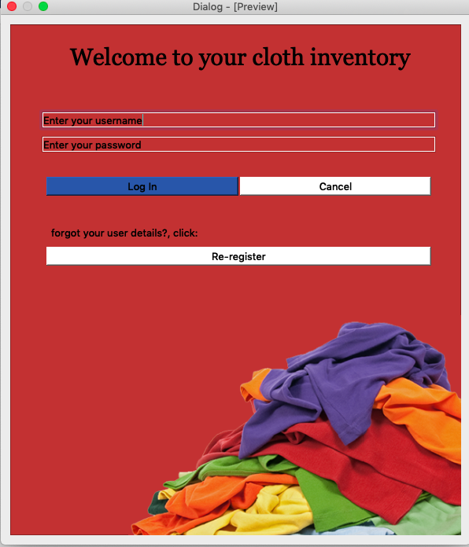
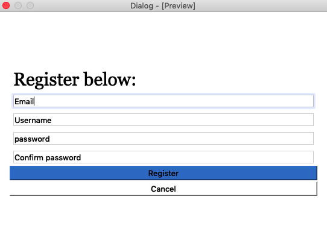
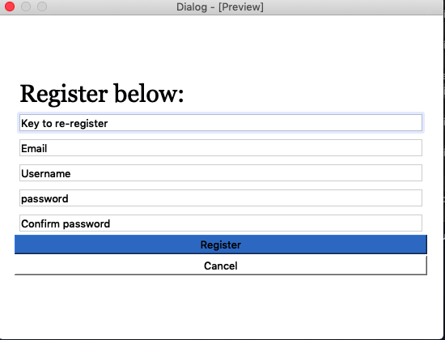
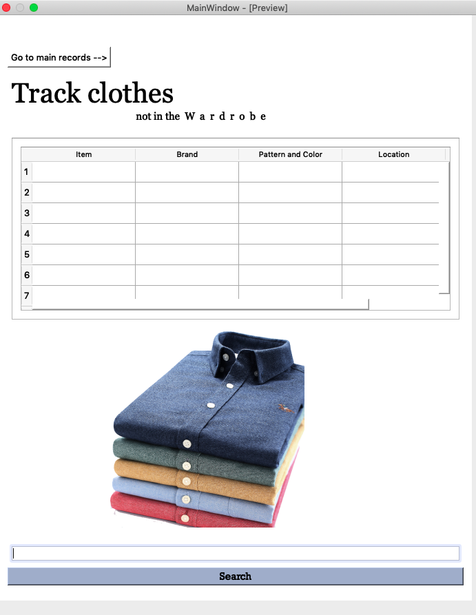
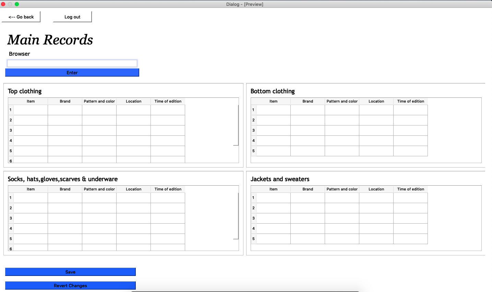
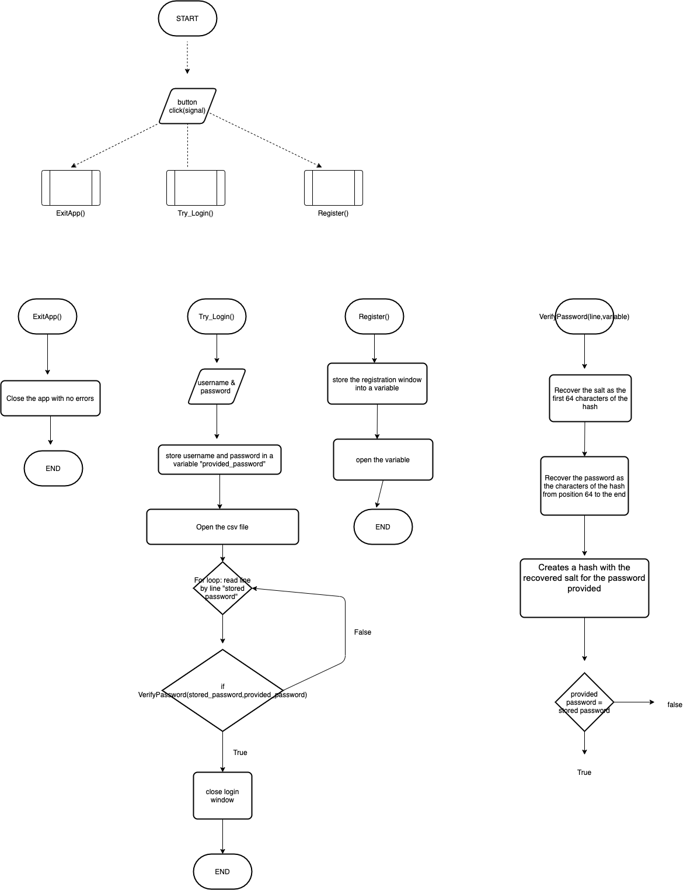
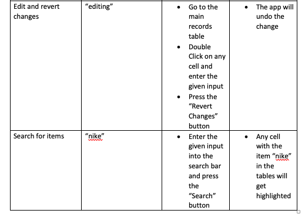

System Diagram
==================
This Figure below is a graphical representation of the system. From the image we can see that the input will be made through a keyboard and a mouse and the output will be shown through a screen monitor. The system will consist of 5 user interfaces which will be described below. The arrows show the interaction between the user interface (one user interface allows the access to another).

User Interfaces
===================
Below are the user interfaces for the inventory app:

Login Window
-------------
Login page gives access to the main Window and the re-register interface

Register Window
----------------
As we can see from Fig and Fig , we have two registration interfaces. However, they serve for different purposes. The first one is to make the first registration and it is a form that comes separate from the app and needs to be ran individually. 
The second was created for the case that the user forgets the password or the username. It allows the user to create a new password and username that will overwrite the old one. The re-registration interface has an input bar for a special key that only the client and me, the developer, know. This is criteria nr 1, which also can be found described by the client in appendix nr. 

Main Window
--------------------
This user interface shows all the item which are not located in the default location and is the main Window to the app. It gives access to the main records window.

Main Records Window 
---------------------
This user interface shows all the recorded items divided into categories and subcategories. It gives access to the main window and has the log out button.

Flowcharts
-------------
The following flowcharts describw the log-in process for the inventory app.

Test Plan
-------------
The application was tested using the dynamic method, which is described in the tables below. Each component was tested individually as the program was developed and at the end of the development, they were tested as a whole.

