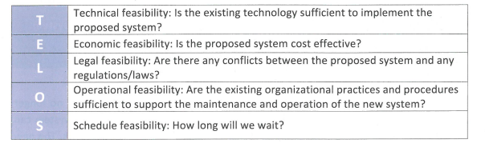

FEASIBILITY TEST
==============

The feasibility study evaluates and analyzes a project and its potential, based on various technical, economical, legal, operational and scheduling criteria.

Technical feasibility
-----------------

The inventory project is a program based application. The main technologies associated with the program are:
1. Python
2. Laptop

Each of these tecnologies are freely available and it's technical skills are managable. 
For this reason, it is clear that the inventory is technically feasible

Economical feasibility
-----------------------

All the tecnologies are available to me and to my client thus, there will be no need to make any further investments. The program will bring many benefits to my client:
it will decrease the time spent looking for clothes and the money spent each year for substituting the clothes that went lost.
For this reason, it is clear that the inventory is economically feasible.

Legal feasibility
-----------

The project uses freely available development tools, and provide the system as an open source system.
For this reason, it is clear that the inventory is legally feasible.

Operational feasibility
------------

From the results of the feasibility tests above and the fact that the only end-user is looking forward to the program, it is clear that the program is operational.
For this reason, it is clear that the inventory is operationally feasible.

Schedule feasibility
-----------------

The program may take 3 months to be ready and most of the development is done in class time which sums up to 160 minutes in average per week. 
For this reason, it is clear that the inventory is schedule feasible.

